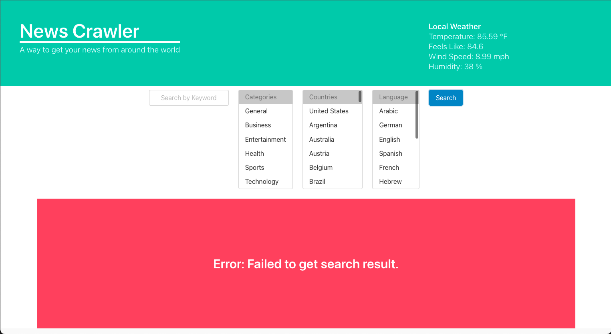
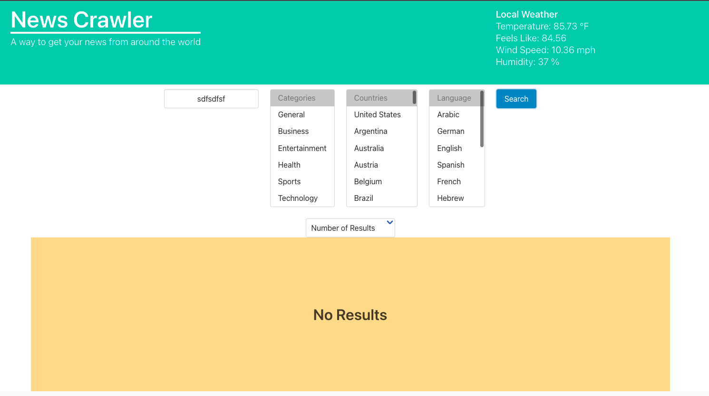
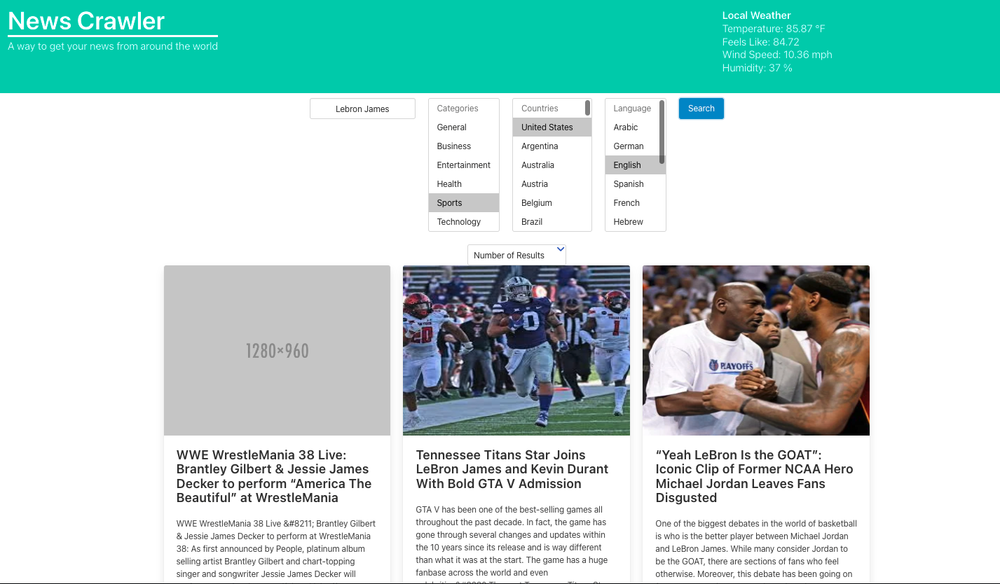

# News Crawler

## Description
Welcome to News Crawler. News Crawler is an application that allows users to view news sources from aroud the world in an easy manner  In developing our application we decided to render current news articles using server-side APIs. We were inspired to create News Crawler to give users access to various forms of news articles that could be displayed in different languages from around the world. We also drew inspiration from the fact that some users might want to view their news from other sources that don't include social media. News Crawler was developed using HTML, Javascript, and Bulma. We decided to use Bulma, a CSS library, to create a layout that allowed for an easy UI experience. Certain elements within our HTML were linked to the Bulma documentation that created buttons, columns, selectors, and headers.

The news API that we used was a free-to-use data source, which means that some of the news articles were not the best quality, nor did all of them have images. We thought about using a different API that would give us access to more high quality articles but the price to use it was farily steep. Perhaps, if we were to get funding, we could decide to implement the better news API. In the future, we also hope to implement a feature that translates the content of the news article title and description into another language that the user specifies. This was one of our original user stores, but we decided against it because the API returned weird and out of place characters that would make it difficult to translate. 

## Link
https://mmoreno723.github.io/group-project-1/

## Usage
When the user opens the page, they will be asked if their location can be used. If they accept, their local weather data will be displayed. 

The user can than search for news articles using the following parameters: keywords, categories, countries, and languages. They can input anything they want for the keyword, or choose not to input one. They can then select the category of news articles they want to see, the country that the articles will originate from, and language that the news article is in. They can select multiple options for the 3 aforementioned parameters using a command click (on mac), or choose to not to select any options. When they click the search button, articles will render based on their search criteria.

When they click search, article cards will render in rows of 3 showing the article image, the article title, the article description, and a button that links to the article url. If they click the button, the article will open in a new tab. A placeholder will be rendered if the article image is missing. If their search criteria yields no results, a yellow "No Results" banner will be rendered instead of the rows of article cards. For example, a bogus keyword will result in "No Results". If the search query to the media stack api returns an error, a red "Error: Failed to get search result" banner will be displayed.

The user can also control the number of article cards that want to see on the page based on their search. The default number is 9. They can select other options from the Number of Results selector, which sticks to the top of the page when they scroll down to view the articles. If they select a number higher than 25, another media stack fetch query will be made, since media stack returns a default number of 25 articles.

Our page saves the user most recent search results to localStorage when a search is made. That way if the user closes the News Crawler page, their most recent search results are automatically rendered when they open the page again. We save the actual response object from media stack to local storage. That way, we won't have to perform another query when the user opens the page again. It would be ideal to save the user's search criteria to local storage instead of the query response object so that we can perform an updated search of articles based on the user's previous search criteria to get updated news when they open the page. However, we are trying to limit the amount of queries we do to media stack since we have a free license which has a limit on the number of queries we can do. 
 
## Credits
Created by Michael Moreno, Eric Hochwald, and Taeyong Lee.

## Screenshot!

